# Designer

dépendance : **Termkey Termcurs**

# Testing 2022-03-21   11h55

* change procSDA procJson 2022-03-21 15h40  modification
* change procMenu 2022-03-23 4h09 Ajustement fonction AltP CrtlP (harmonisation cmd)
* update readme 2022-03-26

---

le but:
Soulager la compréhention par la visualisation des Formulaires puis de générerla génération du code.

Créer des programmes en pure NIM,sans lib externe et occupant peu de place mémoire.

l'utilisation de **Termvte** , crée une fenêtre terminale, beaucoup plus souple à gérer que xterm etc...

elle peut fonctionner dans un terminal que vous paramétrez.

# utilisation du logiciel:

Utiliser la souris pour naviguer, sélectionner, positionner...

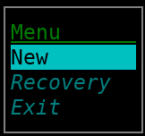

* [ ] New permet de créer un formulaire et de le sauvegarder au format JSON et génère un source.nim

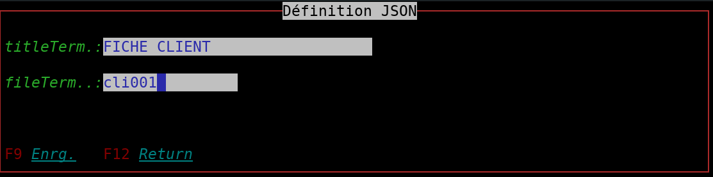

titleTerm.: Nom étendu du fichier comprenant l'ensemble des panels

fileTerm..: Nom du fichier  (exemple.dspf)

> F9  enregistre

> F12 abandon

Recovery: Recharge le display file en mémoire. Apporter toutes les modifications jugées nécéssaires.

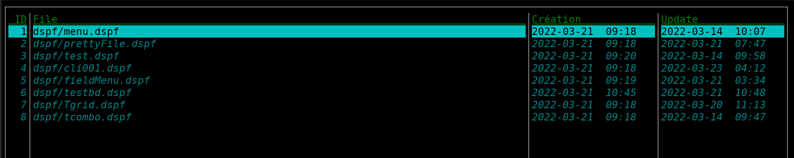

---

* [ ] création du panel

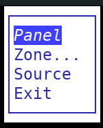

* [ ] choix : créer = "999 add panel" sinon cliquer sur une ligne

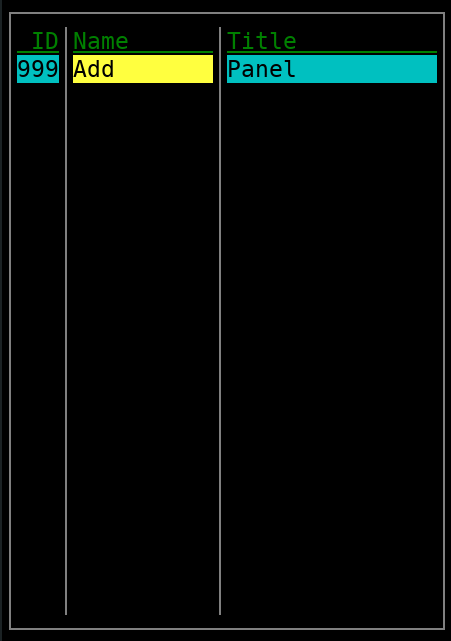

* [ ] Saisie de la structure du panel

  fonction saisie clavier:
  up / down -- tab / tabs -- enter, pour valider la zone de saisie et passer à la zone suivante.

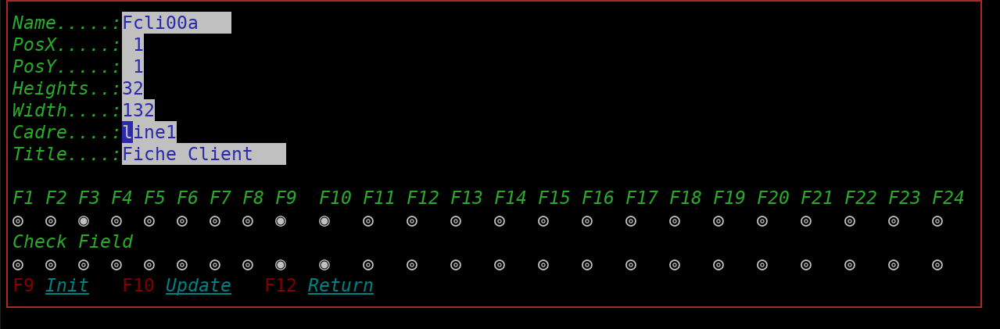

Name......: Obligatoire, le référencement et le panel sont lier voir exemple dans le source.

PosX,Y....: récupération du positionement de la souris

Heights...: nombre de lignes verticales

Width.....: nombre de caractères horizontals

Cadre.....: appuyer sur une touche, le choix apparaît ligne1 = 1 ligne

Title.....: Titre du panel

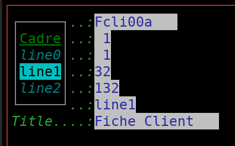

les touches de fontion F1..F24 appuyer sur la bar d'espacemant pour activé la fonction

Check Field..:  associer le controle par défault des zones comprise dans le panel

> *F3* n'a pas besoin de crontôle ex: = exit programe
>
> *F9 F11* on besoin de faire le contrôle car les données ont des conséquences
>
> vous pouvez dans le source affecter à la main d'autre valeur  ex CtrlV
>
> leurs donner un text plus explicite ex F9 = F9 Enrg.
>
> si vous ne mettez pas de text la fonction n'est pas visible à l'écran mais active
>
> ne pas ce servir CrtlH qui est réserver à la saisie.
>
> ex:`defButton(TKey.F3,"F3 Exit.",false)` `defButton(TKey.F9,"F9 Enrg.",true)` `defButton(TKey.CtrlV,"",true)`

---

paneaux de définition des labels Fields Menus Combo/Grid

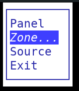

pointer la souris pour positioner l'objet que vous voulez décrire.

altL -> Label  puis tapez votre label CtrlV valide le label

altT -> Titre  idem label

altF -> Field

altM -> Menu

altP -> display de tous les  menus

altG -> Combo/Grid

altD -> affichage des objet Label Field Menu

altO -> réordonner les objet Label Field

altR -> remove les objet Label Field Menu Combo/Grid

altS -> réaffichage du terminal

CtrlQ -> fermeture du panel retour au menu principal

CtrlH -> réserver à la saisie pour Help field

---

* [ ] titre

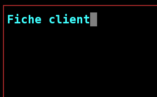

vaidation CtrlV


* [ ] label Idem ex nom....:

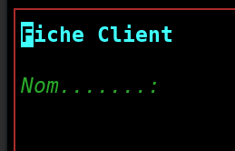

---

* [ ] définition FIELD
  Field altF
  choix ajouter ou modifier

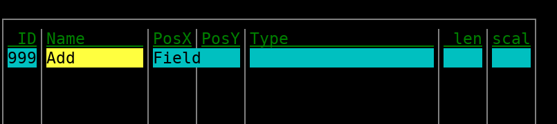

veuillez valider chaque zone

Name      : nom du buffer

PosX,Y    : défini au moment du clique de la sourie

Ref.Type  : détermine le mode de sasie

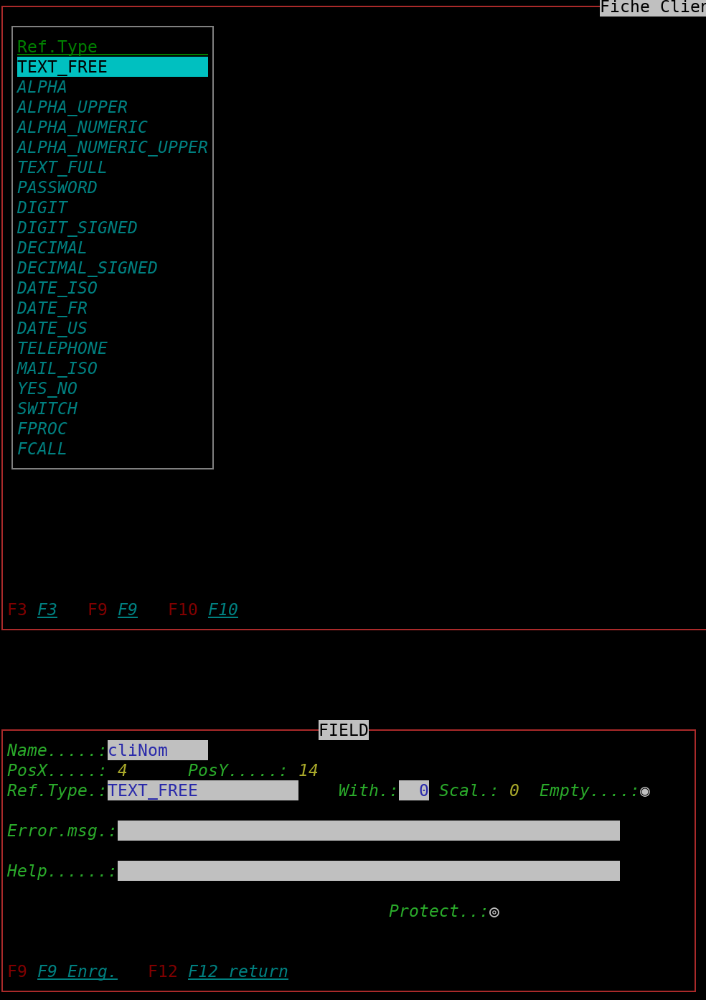

définition attribut

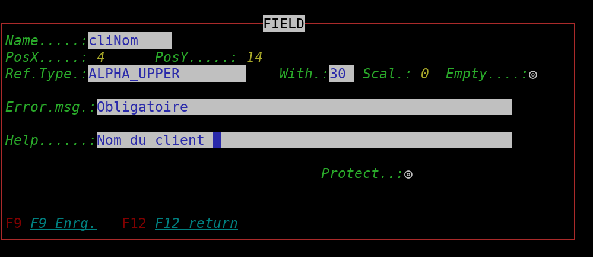

With -> nombre d'entier

Scal -> Nombre de décimal après la virgule

Empty-> Vide = on sinon la zone est obligatoire

Error -> message ce rapportant à la zone pour l'utilisateur

Help -> aide avec la touche CtrlH

Edt.Char -> code par exemple : € $ ¥ ₪ £ %

Protect -> falg interdisant la saisie ou modification.
Est utile lors de saisie de clef de table et modification des zones si rapportant ex: saisie du n° client puis saisie des coordonnés du client.

pour les zones Hiden

exemple
pnlF1.hiden.add(defStringH("zone3",TEXT_FULL, "12101951"))                  # full String n° client
pnlF1.hiden.add(defStringH("zone10",DATE_ISO, "2020-04-24"))                # full String
pnlF1.hiden.add(defSwitchH("zone15", SWITCH,true))                          # specifique switch
pnlF1.hiden.add(defStringH("zone8",DECIMAL, "256.05"))                      # full String

exemple : Decimal

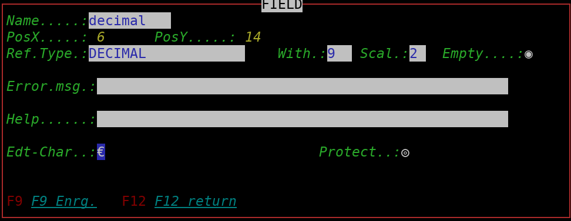

exemple : appel process
appel automatiquement la procédure ex: un combo ou calcul avec retour de donnés...

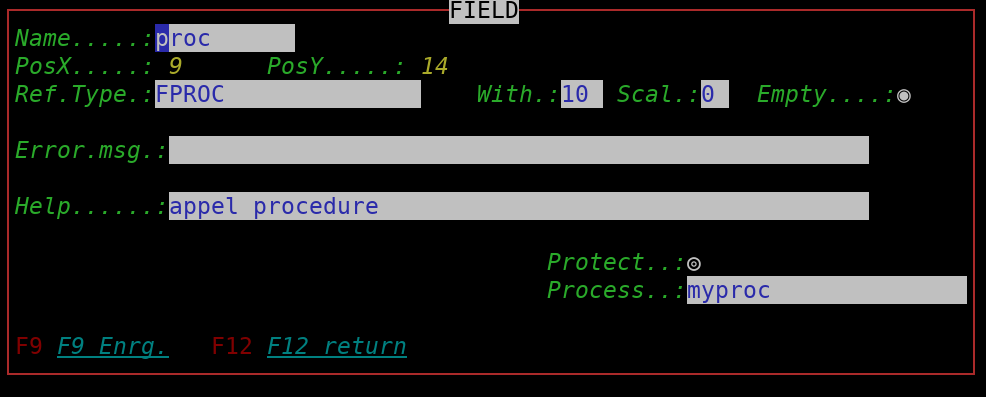

* [ ] Définition du Combo/Grid
  AltG

pensez à l'association de la zone process et name.combo

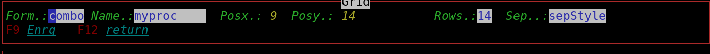

* [ ] Définiton des titres des  colonnes

AltC

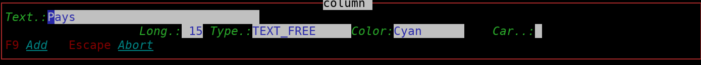

* [ ] enregistrement data pour les colonnes

AltI   Item

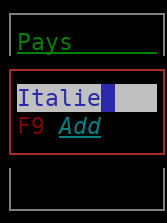

AltC entete

AltI Item uniquement combo

AltP liste colonne

AltR remove colonne

AltD display combo/grid

AltS retour à la Définition du Combo/Grid

Résultat :

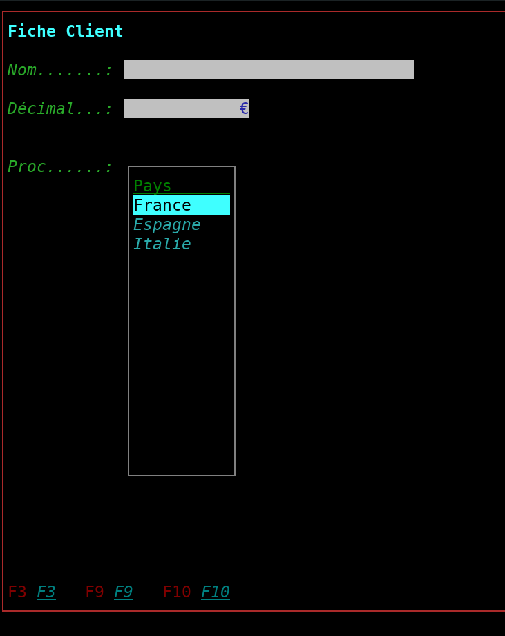

Idem pour le Grid sans les items

pour sauvegarder le combo/grid  CtrlV

pour quitter l'envirronement de définition combo/grid AltQ

---

* [ ] Menu:

CtrlV  validation

CtrlP  display menu

AltP   display full menu

AltS   refresh saisie menu

> F9 enregistrement

> F12 return

Name : nom du menu

cadre : line1  | line2 ||

Vertical ou Horizontal

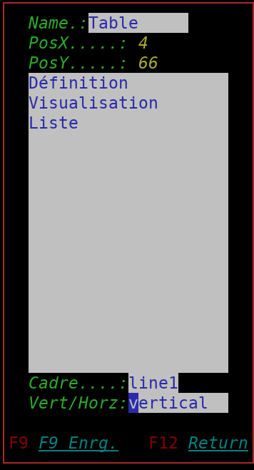

exemple:

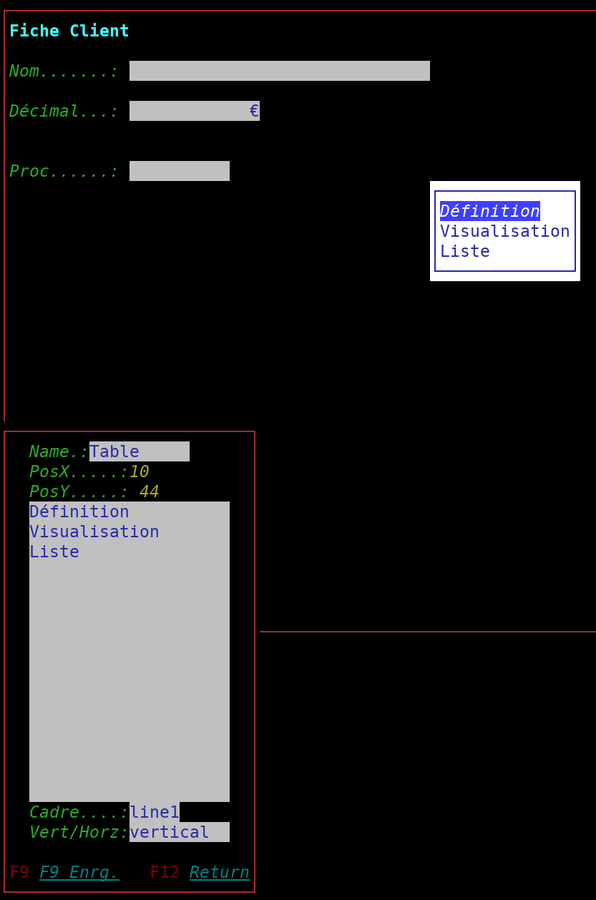

---

* [ ] sauvegarde:

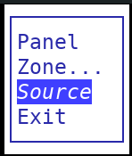

dans la sous directorie ./dspf

name.dspf fichier json

dans la directorie du programme TermSDA le source.nim que vous pouvez compiler

---

envirronement de travail

TermSDA et Tsource son des executables des terminaux fait avec C++ GTK libvte
ex: Tsource vous permez d'excuter Source dans une fenêtre terminal

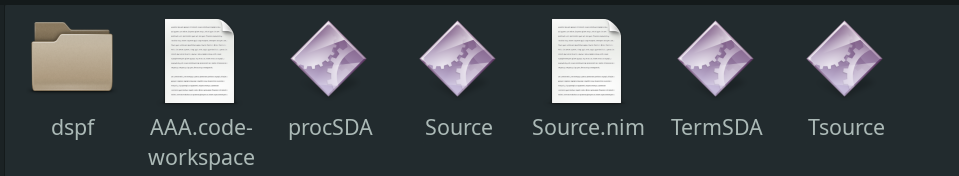

ps:

1. le proc faisant appel à la fonction  FCALL  n'est pas defini
2. la gestion du grid vous est laissé à faire à la main un exemple complet dans exemple
3. nim c -f --gc:orc -d:useMalloc --passc:-flto --passC:-fno-builtin-memcpy --verbosity:0 --hints:off --threads:on -d:release -o:procSDA procSDA.nim
4. creer un dossier placer le programme TermSDA et le programme procSDA dans ce dossier Idem pour TSource
5. creer un sous dossier dspf et obj->(pour compiler TermSDA.ccp fenêtre window)
6. les dossiers:
   .vscode -les procedures et envirronement VSCODE
   exemple -programme nim
   src     -programme terminal ccp
   proc...


| programme | Text                     |
| ----------- | -------------------------- |
| procCurs  | interne(termcurs)        |
| procField | definition Field         |
| procLabel | definition Label         |
| procGrid  | definition Grid/Combo    |
| procMenu  | definition Menu          |
| procPanel | definition Panel         |
| procInit  | ouveture programme SDA   |
| callqry   | combo commun             |
| procJson  | lecture / écriture JSON |
| procSDA   | programme Principal      |
| makefile  | outil pour compiler ccp  |

VSCODE :

**Task Manager** extension
--------------------------

exemple source généré:

```
import termkey
import termcurs
import tables


var callQuery: Table[string, proc(fld : var FIELD)]


type
  FIELD_Fcli00a {.pure.}= enum
    cliNom,
    decimal,
    tproc
const P1: array[FIELD_Fcli00a, int] = [0,1,2]


# MENU -> TEST
var Table = new(MENU)
Table = newMenu("Table", 10, 44, vertical, @["Définition", "Visualisation", "Liste"], line1)


# Panel Fcli00a

var Fcli00a= new(PANEL)

# description
proc dscFcli00a() =
  Fcli00a = newPanel("Fcli00a",1,1,32,132,@[defButton(TKey.F3,"F3",false,true), defButton(TKey.F9,"F9",true,true), defButton(TKey.F10,"F10",true,true)],line1,"Fiche Client")

  # LABEL  -> Fcli00a

  Fcli00a.label.add(defTitle("L02002", 2, 2, "Fiche Client"))
  Fcli00a.label.add(deflabel("L04002", 4, 2, "Nom.......:"))
  Fcli00a.label.add(deflabel("L06002", 6, 2, "Décimal...:"))
  Fcli00a.label.add(deflabel("L09002", 9, 2, "Proc......:"))

  # FIELD -> Fcli00a

  Fcli00a.field.add(defString("cliNom", 4, 14, ALPHA_UPPER,30,"", FILL, "Obligatoire","Nom du client"))
  Fcli00a.field.add(defNumeric("decimal", 6, 14, DECIMAL,9,2,"", EMPTY,"", ""))
  setEdtCar(Fcli00a.field[P1[decimal]], "€")
  Fcli00a.field.add(defString("tproc", 9, 14, FPROC,10,"", EMPTY, "","appel procedure"))
  setProcess(Fcli00a.field[P1[tproc]],"myproc")


#===================================================
proc myproc(fld : var FIELD) =
  var Cell_pos : int = -1
  var Xcombo  = newGRID("myproc",9,14,14,sepStyle)
  var Cell_Pays = defCell("Pays",10,TEXT_FREE,"Cyan")
  setHeaders(Xcombo, @[Cell_Pays])
  addRows(Xcombo, @[ "France" ])
  addRows(Xcombo, @[ "Espagne" ])
  addRows(Xcombo, @[ "Italie" ])

  printGridHeader(Xcombo)
  case fld.text
    of "France"   : Cell_pos = 0
    of "Espagne"   : Cell_pos = 1
    of "Italie"   : Cell_pos = 2
    else : discard

  while true :
    let (keys, val) = ioGrid(Xcombo,Cell_pos)
    case keys
      of TKey.Enter :
        restorePanel(Fcli00a,Xcombo)
        fld.text  = $val[0]
        break
      else: discard

callQuery["myproc"] = myproc
#===================================================


proc main() =
  initTerm(32,132)

  dscFcli00a()
  printPanel(Fcli00a)
  displayPanel(Fcli00a)

  # ONLY -> FOR TEST
  dspMenuItem(Fcli00a,Table,0)
  let nTest = ioMenu(Fcli00a,Table,0)


  #Exemple ------

  while true:
    let  key = ioPanel(Fcli00a)
    case key
      of TKey.PROC :  # for field Process
        if isProcess(Fcli00a,Index(Fcli00a)):
          callQuery[getProcess(Fcli00a,Index(Fcli00a))](Fcli00a.field[Index(Fcli00a)])
      of TKey.F3:
        break
      of TKey.F9:
        break
      of TKey.F10:
        break
      else : discard

  closeTerm()


main()

```
